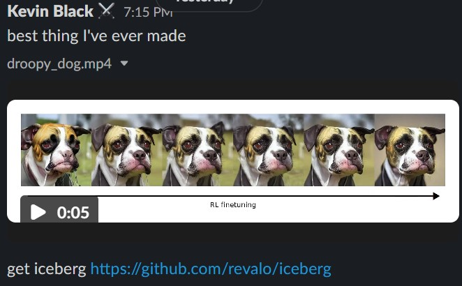
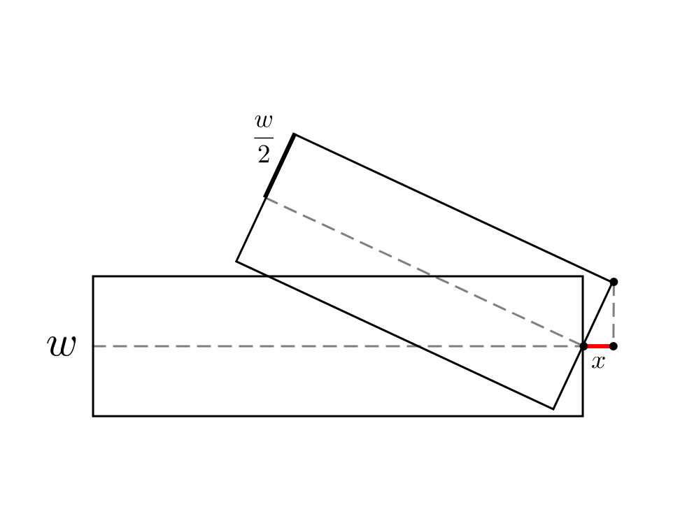
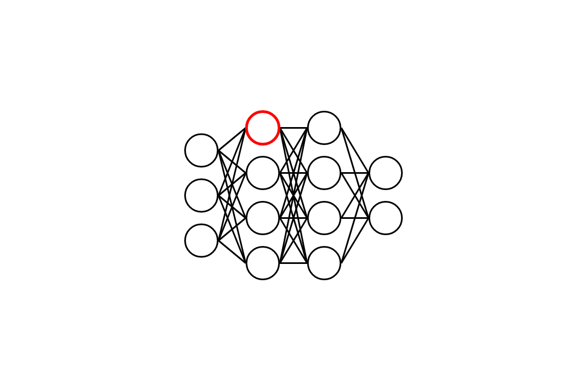
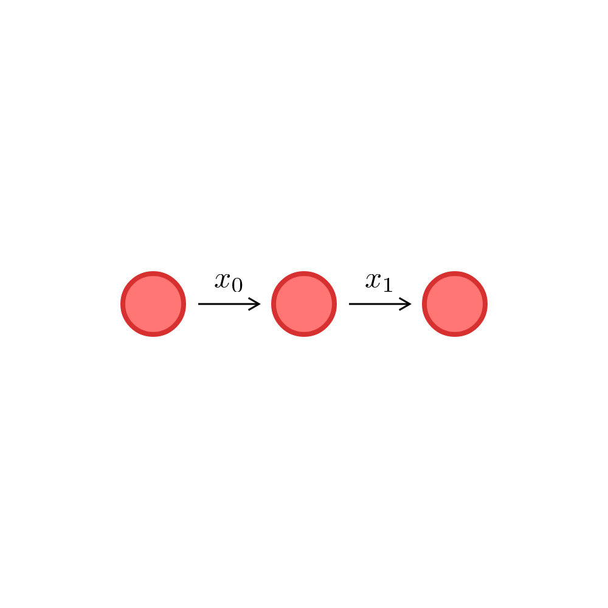

# IceBerg


<p align="center">

</p>

Iceberg is a compositional diagramming and graphics library embedding in Python. It is designed to be performant, extensible, and easy to use.

<p align="center">

</p>
<p align="center">
<i>The above animation was 33 lines of code</i>
</p>

## Testimonials

<p align="left">

</p>
<p align="left">

</p>

## Showcase

### Geometry




### Neural Network

A composable Neural Network diagramming class written in iceberg. Full example in `examples/neural_network.py`.



```python
network = NeuralNetwork(
    # Number of nodes in each layer!
    [3, 4, 4, 2],
    node_border_color=Colors.BLACK,
    line_path_style=PathStyle(Colors.BLACK, thickness=3),
)
node = network.layer_nodes[1][0]
node.border_color = Colors.RED
node.border_thickness = 5

canvas = Blank(Bounds(size=(1080, 720)), background=Colors.WHITE)
scene = canvas.add_centered(network)

renderer = Renderer()
renderer.render(scene)
renderer.save_rendered_image("test.png")

```

### Tex, Arrangements, SVG Outputs

Iceberg supports Tex and Arrangements. Full example in `examples/connect.py`.

<p align="left">

</p>

```python
left_ellipse = Ellipse(
    Bounds(size=(_CIRCLE_WIDTH, _CIRCLE_WIDTH)),
    border_color=Color.from_hex("#d63031"),
    border_thickness=_BORDER_THICKNESS,
    fill_color=Color.from_hex("#ff7675"),
).pad(_CIRCLE_PAD)

right_ellipse = Ellipse(
    Bounds(size=(_CIRCLE_WIDTH, _CIRCLE_WIDTH)),
    border_color=Color.from_hex("#0984e3"),
    border_thickness=_BORDER_THICKNESS,
    fill_color=Color.from_hex("#74b9ff"),
).pad(_CIRCLE_PAD)

ellipses = Arrange(
    [left_ellipse, right_ellipse],
    gap=500,
)

with ellipses:
    # Within this context, we can use `relative_bounds` to get the bounds of the
    # `left_ellipse` and `right_ellipse` relative to the `ellipses` object.
    arrow = Arrow(
        left_ellipse.relative_bounds.corners[Corner.MIDDLE_RIGHT],
        right_ellipse.relative_bounds.corners[Corner.MIDDLE_LEFT],
        line_path_style=PathStyle(
            color=Colors.BLACK,
            thickness=3,
        ),
    )

arrow_label = MathTex("f(x) = x^2", scale=4)
arrow = LabelArrow(
    arrow,
    arrow_label,
    Corner.BOTTOM_MIDDLE,
    distance=20,
)
connection = Compose([ellipses, arrow])

text_block = Text(
    "This is some really long text, and it's going to wrap around at some point, because it's so long and I spent a lot of time on it.",
    font_style=FontStyle(
        family=_FONT_FAMILY,
        size=28,
        color=Colors.BLACK,
    ),
    width=connection.bounds.width,
)

scene = Arrange(
    [connection, text_block],
    gap=10,
    arrange_direction=Arrange.Direction.VERTICAL,
)
```

### Animations

IceBerg can take a difference between two scenes and interpolate the difference.

```python
sceneA = blank.add_centered(arrangeA)
sceneB = blank.add_centered(arrangeB)

# Interpolate between two different arrangements.
scene = tween(sceneA, sceneB, t / self.duration)
```

<p align="left">

</p>

## Install

The library is still under development, hence updates are frequent. To install the latest version, run the following command:

```
pip install git+https://github.com/revalo/iceberg.git
```

**Not recommended yet**, but if you want a stable version, use the PyPI package.:


```
pip install -U iceberg-dsl
```

## Quickstart

Full example in `examples/quickstart.py`.

```python
from iceberg import Renderer, Bounds, Colors, FontStyle
from iceberg.primitives import Rectangle, Blank, SimpleText, Directions

# Blank is a large empty rectangle.
canvas = Blank(Bounds(size=(1080, 720)))

# Create a rectangle.
rectangle = Rectangle(
    Bounds(size=(500, 100)),
    Colors.WHITE,
    border_thickness=3,
)

# Create a text.
text = Text(
    text="Hello, World!",
    font_style=FontStyle(
        family="Arial",
        size=28,
        color=Colors.WHITE,
    ),
)

# Place the text below the rectangle.
rectangle_and_text = rectangle.next_to(text, Directions.DOWN * 10)

# Center the rectangle and text combination to the canvas.
scene = canvas.add_centered(rectangle_and_text)

# Render the scene and save it to a file.
renderer = Renderer()
renderer.render(scene)
renderer.save_rendered_image("test.png")
```

Should produce:


## Citation

Cite Iceberg by clicking the "cite this repository" button on the right sidebar.

```
@software{IceBerg_Contributors_IceBerg_Compositional_2023,
    author = {{IceBerg Contributors}},
    license = {MIT},
    month = jul,
    title = {{IceBerg – Compositional Graphics & Diagramming}},
    url = {https://github.com/revalo/iceberg},
    year = {2023}
}
```
